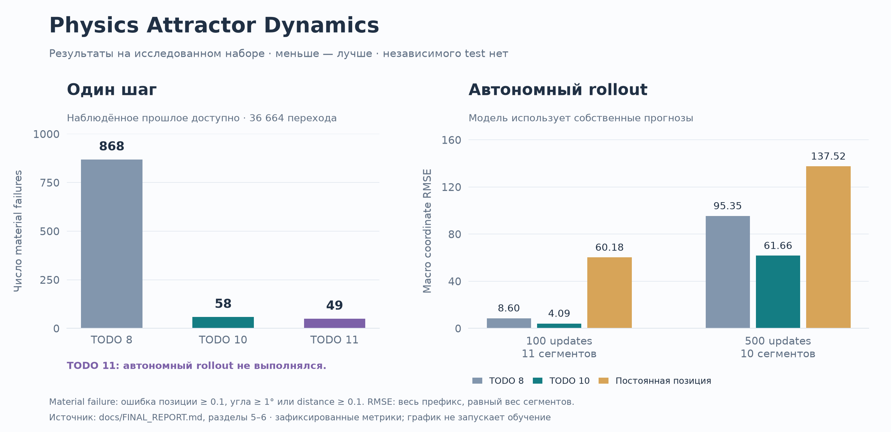

# Physics Attractor Dynamics

**Восстановление неизвестного дискретного симулятора по временным рядам.**
Исследовательский проект по system identification: аудит данных, проверка
физических гипотез и гибридная модель из явных правил и Random Forest.

Из наблюдений восстановлены порядок обновления двух объектов, свободное
движение, стандартные отражения, геометрия границ и точная формула специального
угла. Основной неизвестной остаётся момент входа в редкий режим у стены.

**Ключевой результат:** формульная модель с ML-selector воспроизводит **98.75%**
отдельных переходов в строгом численном допуске при доступном наблюдённом прошлом.
У версии с проверенным автономным rollout медиана первого заметного расхождения
выросла **с 89 до 189 updates**. Это разные эксперименты; независимого финального
test у проекта нет.

[Итоговый отчёт](docs/FINAL_REPORT.md) ·
[Основной notebook](notebooks/attractor_todo.ipynb) ·
[История экспериментов](docs/EXPERIMENT_HISTORY.md) ·
[Теория](docs/THEORY.md)



## Задача и подход

По координатам, углам и расстоянию между двумя объектами требуется восстановить
правило следующего шага и проверить, насколько долго оно работает автономно.
Исходный код генератора неизвестен; физические единицы не подтверждены.

Первоначальная гипотеза — непрерывная ODE, найденная методом SINDy.
Проверенные ODE-модели не прошли заранее заданные validation gates.
Аудит выявил другую структуру: одна строка CSV содержит последовательные
обновления объектов, а timestamp записи не задаёт длительность шага симулятора.
Исследование продолжилось как восстановление дискретной гибридной системы.

```text
Наблюдённое прошлое
  → свободный шаг объекта 1 → выбор режима → позиция объекта 1
  → вычисленное промежуточное расстояние
  → свободный шаг объекта 2 → выбор режима → позиция объекта 2
```

Модель сочетает три механизма:

- **Явные правила:** движение, отражения и ограничение координат у границ.
- **PERIOD2:** детерминированное продолжение обнаруженного двухшагового цикла.
- **SPECIAL:** Random Forest выбирает редкий режим, формула вычисляет его угол.

Например, обнаружено тождество `distance[i] = ‖p1[i] − p2[i−1]‖` с ошибкой
меньше `1.6 × 10⁻⁷`. Для специального угла восстановлено
`θ = atan(0.2 / cos φ)`, где `φ` — расстояние свободного угла до ближайшей оси.
На 1 146 обычных special wall-событиях максимальная ошибка `θ` — около
`5.3 × 10⁻⁸°`. Это проверка формулы при данном режиме, а не точность его выбора.

## Результаты

Основной цикл экспериментов TODO 1–16 завершён. Числа ниже взяты из
[итогового отчёта](docs/FINAL_REPORT.md), сверенного с локальным полным запуском notebook.
В Git хранится notebook без outputs; итоговые таблицы и график доступны без запуска.
TODO-номера обозначают этапы исследования и соответствуют разделам в коде.

### Прогноз одного шага: наблюдённое прошлое доступно

Оценены **36 664 полных перехода внутри 11 сегментов**. Объект 2 получает
расстояние, вычисленное из прогноза объекта 1. Между шагами доступна фактическая
история; эти результаты нельзя переносить на автономный прогноз.

| Модель | Numerical-exact, % | Material failures | Статус |
| --- | ---: | ---: | --- |
| Стандартные правила, TODO 8 | 96.3452 | 868 | Формульный baseline |
| Точный special-angle + RF, TODO 10 | 98.6935 | 58 | Выполнен автономный rollout |
| Stateful selector, TODO 11 | **98.7508** | **49** | Лучший one-step selector |

Полное состояние — четыре координаты, два угла и промежуточный `distance`.
Успех требует одновременного выполнения всех допусков:

| Критерий | Ошибка позиции каждого объекта | Ошибка угла | Ошибка distance |
| --- | ---: | ---: | ---: |
| Numerical-exact | `< 10⁻⁵` | `< 2 × 10⁻⁶°` | `< 2 × 10⁻⁶` |
| Material | `< 0.1` | `< 1°` | `< 0.1` |

Позиционная ошибка — евклидова, угловая — круговая. Нарушение любого material-
допуска считается одним material failure. Это экспериментальные допуски
в единицах датасета. Общие проценты взвешены количеством переходов.

TODO 11 снизил число заметных ошибок на 15.5% относительно TODO 10,
но не прошёл заранее заданный gate `≤ 40 failures`. Поэтому автономный rollout
для TODO 11 не выполнялся и его преимущество в этом режиме не установлено.

### Автономный rollout: только начальное состояние

Здесь модель TODO 10 последовательно использует собственные прогнозы.
Каждый запуск начинается с первой строки своего сегмента.

| Горизонт, updates | RMSE TODO 8 | RMSE TODO 10 | Constant-position baseline |
| --- | ---: | ---: | ---: |
| 100 | 8.6045 | **4.0930** | 60.1758 |
| 500 | 95.3492 | **61.6632** | 137.5219 |
| Весь сегмент | 169.3087 | **158.8421** | 169.2509 |

RMSE вычисляется по четырём координатам на всём префиксе до горизонта,
затем усредняется с равным весом сегментов. На горизонте 500 доступны 10
сегментов, на остальных — 11; полные сегменты имеют разную длину.

Медианный первый material failure сдвинулся **89 → 189 updates**.
У TODO 10 диапазон — **1–469 updates**: 189 не является гарантией для любого
старта. На длинном горизонте траектории существенно расходятся.

## Валидация и ограничения

- **Разбиение по эпизодам:** leave-one-segment-out (LOSO), без случайного
  перемешивания соседних строк. Для TODO 11 пороги входа и продолжения выбраны
  через nested LOSO: 55 pairwise RF-моделей исключали outer и inner сегменты.
- **Нет pristine holdout:** первичный аудит затрагивал весь набор; в TODO 6
  test был преждевременно просмотрен, его результат аннулирован. Позднее все
  сегменты участвовали в открытии правил. LOSO ограничивает утечку при fit,
  но не отменяет адаптацию исследования к данным. Нужны новые эпизоды.
- **Reset не моделируется:** переходы между сегментами исключены. Условие
  входа в SPECIAL и часть начального скрытого состояния остаются неизвестны.
- **One-step и rollout различаются:** наблюдённая история помогает one-step.
  Часть обучающих признаков объекта 2 условна на наблюдённом промежуточном
  состоянии; возможен train/inference mismatch.
- **Физическая трактовка ограничена:** нет подтверждения гравитации, физических
  единиц или законов сохранения. Результат описывает данный симулятор.

Анализ TODO 14 связал 49 material failures TODO 11 с выбором режима:
24 пропущенных входа, 24 ложных срабатывания и один переход с неразрешённой
инициализацией. Отдельные entry/continuation heads, сырая история и 31 новый
признак динамики не улучшили результат. Отрицательные ablations сохранены
в [отчёте](docs/FINAL_REPORT.md), включая причины отклонения ODE-моделей.

## Данные и происхождение

Источник — Kaggle: [Physics attractor time series](https://www.kaggle.com/datasets/nikitricky/physics-attractor-time-series),
автор страницы `nikitricky`. Использован архив `physics-attractor-time-series.zip`
с файлом `data.csv`: 36 675 строк, восемь содержательных полей и восемь пустых
столбцов. По пространственным скачкам выделены 11 непрерывных сегментов.

Содержательные поля: `time`, `pos1x`, `pos1y`, `pos2x`, `pos2y`, `distance`,
`angle1`, `angle2`. Порядок записей сохраняется; время монотонно, шаг записи
неравномерен. В дискретной модели время измеряется числом updates.

**Исходный датасет не входит в репозиторий:** каталог `data/` исключён из Git.
Лицензионные условия датасета не зафиксированы в материалах проекта; перед
загрузкой, использованием и распространением нужно проверить условия источника.
Вопрос о лицензии кода проекта также остаётся открытым.

## Воспроизведение

Проверено на **Python 3.12**; проект использует **uv**. Зависимости описаны в `pyproject.toml`,
версии зафиксированы в `uv.lock`; окружение хранится в локальной `.venv/`.
Основной стек: NumPy, pandas, SciPy, scikit-learn, PySINDy, Matplotlib, Jupyter.

Из корня локальной копии проекта установите зависимости:

```sh
uv sync --frozen --dev
```

Получите разрешённую копию датасета у источника и поместите ZIP-архив без
распаковки по пути `data/physics-attractor-time-series.zip`.

Запустите notebook и выполните **Restart Kernel and Run All Cells**:

```sh
uv run --no-sync jupyter lab notebooks/attractor_todo.ipynb
```

Быстрые тесты признаков выполняются без исходного датасета и обучения моделей:

```sh
uv run --no-sync python -m unittest discover -s tests -v
```

Проверить синтаксис notebook и отсутствие сохранённых outputs:

```sh
uv run --no-sync python scripts/check_notebook.py
```

После интерактивного запуска добавьте `--clean` к этой команде: она сначала
сохранит полную копию в игнорируемый каталог `output/`, затем очистит outputs.
GitHub Actions выполняет эти быстрые проверки без скачивания датасета;
полное воспроизведение исследования остаётся отдельным запуском.

Для полного повторного расчёта с сохранением отдельной выполненной тетради:

```sh
mkdir -p output
uv run --no-sync jupyter nbconvert \
  --to notebook --execute \
  --ExecutePreprocessor.timeout=1800 \
  --output attractor_todo.executed.ipynb --output-dir output \
  notebooks/attractor_todo.ipynb
```

Полный запуск переобучает модели, включая nested RF-эксперименты, и занимает
существенно больше времени, чем тесты. В сохранённом запуске — 76 code cells
без ошибок. Пять feature-тестов проверяют признаки и границы истории;
они не заменяют проверку научных выводов и весь расчёт notebook.

## Структура проекта

| Путь | Содержание |
| --- | --- |
| [`notebooks/attractor_todo.ipynb`](notebooks/attractor_todo.ipynb) | Основная тетрадь: аудит, эксперименты и результаты |
| [`notebooks/todo9_hybrid.py`](notebooks/todo9_hybrid.py) | PERIOD2, признаки и RF-selector |
| [`notebooks/todo10_exact_special.py`](notebooks/todo10_exact_special.py) | Точный special-angle и autonomous rollout |
| [`notebooks/todo11_stateful_selector.py`](notebooks/todo11_stateful_selector.py) | Stateful policy и nested LOSO |
| `notebooks/todo12_…py` — `todo16_…py` | Ablations и анализ остаточных ошибок |
| [`tests/test_todo16_features.py`](tests/test_todo16_features.py) | Быстрые тесты причинных признаков |
| [`docs/FINAL_REPORT.md`](docs/FINAL_REPORT.md) | Формулы, полные таблицы и ограничения |
| [`docs/EXPERIMENT_HISTORY.md`](docs/EXPERIMENT_HISTORY.md) | Архив подробного README с историей этапов |
| [`notebooks/attractor_todo.py`](notebooks/attractor_todo.py) | Историческая Marimo-версия до продолжения в Jupyter |

Companion-скрипты выполняются из основной тетради и используют состояние
предыдущих ячеек; отдельных CLI entry points у них нет.
